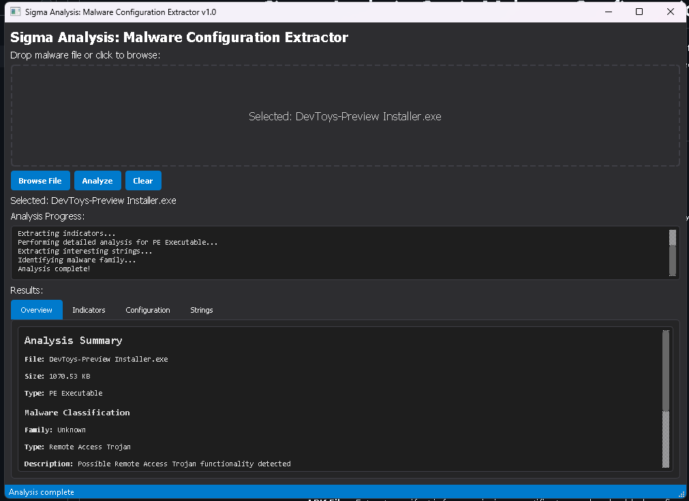

# Sigma Analysis: Static Malware Configuration Extractor

Sigma Analysis is a Python-based tool designed to analyze malware files, extract configurations, URLs, and other indicators from them, and identify the malware family. This tool features a modern interface and comprehensive detection capabilities.



## Features

- **Modern User Interface**: Clean, intuitive GUI built with PyQt5
- **Multiple File Type Support**: Analyze EXE, APK, Python, and Batch files
- **Automatic Dependency Management**: Required packages are installed automatically
- **Malware Family Identification**: Identifies common malware families and their types
- **Comprehensive Detection**: Extract a wide variety of indicators:
  - URLs and domain names
  - Discord webhooks
  - Telegram bot tokens
  - IP addresses
  - Bitcoin addresses
  - AWS keys
  - Email addresses
  - Registry keys

- **Deep Analysis Based on File Type**:
  - **PE Files**: Extract imports, sections, resources, and headers
  - **APK Files**: Extract manifest info, permissions, certificates, and embedded configs
  - **Python Files**: Analyze imports, variables, classes, and obfuscated strings
  - **Batch Files**: Identify variables, commands, downloads, and persistence mechanisms

- **Intuitive Results Display**: View findings categorized by type in a tabbed interface

## Malware Classification

Sigma Analysis includes a classification engine that can identify various malware families, including:

- **Information Stealers**: RedLine, Raccoon, Vidar, Arkei, FormBook, etc.
- **Remote Access Trojans**: AsyncRAT, Remcos, NjRAT, DarkComet, etc.
- **Banking Trojans**: TrickBot, Zeus, QakBot, Emotet, etc.
- **Keyloggers**: Agent Tesla, Snake Keylogger, etc.
- **Generic Malware Types**: When specific families cannot be identified, the tool will attempt to classify by functionality (Ransomware, Miner, Botnet, etc.)

The classification system provides a confidence rating and description for each identification.

## Requirements

- Python 3.6 or higher
- The tool automatically installs the following dependencies if not present:
  - PyQt5
  - requests
  - pyaxmlparser
  - pefile
  - androguard
  - uncompyle6
  - colorama

## Usage

1. Run the script:
   ```
   python SigmaAnalysis.py
   ```

2. Either:
   - Drag and drop a file onto the application window
   - Click the "Browse File" button to select a file
   - Click anywhere in the drop area to open the file browser

3. Click "Analyze" to begin the analysis process

4. View the results in the tabbed interface:
   - **Overview**: Summary of findings including malware classification
   - **Indicators**: Detailed list of all found indicators
   - **Configuration**: Extracted configuration details specific to the file type
   - **Strings**: Interesting strings found in the file

## How It Works

Sigma Analysis uses a combination of techniques to extract information:

1. **Regular Expression Pattern Matching**: Identify common indicators like URLs, IPs, and tokens
2. **Format-Specific Analysis**: Use specialized libraries to analyze specific file formats
3. **String Extraction**: Pull out interesting strings that may indicate configuration data
4. **Signature Matching**: Compare findings against a database of known malware families
5. **Behavioral Analysis**: Identify malware functionality based on code patterns and configuration

## License

This project is released under the MIT License.

## Disclaimer

This tool is designed for defensive security research and educational purposes only. Always ensure you have legal permission to analyze any file. The authors are not responsible for any misuse of this tool.
